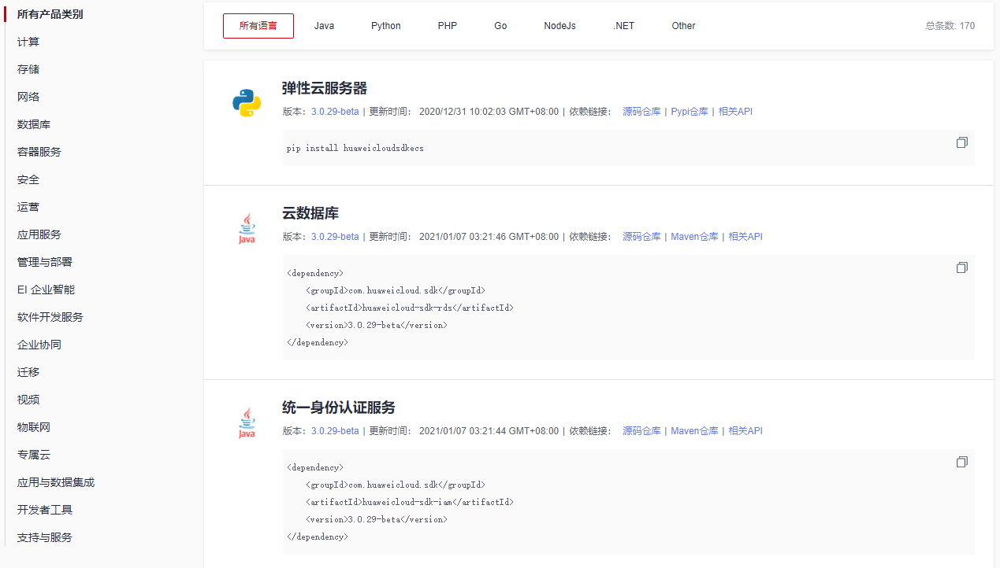
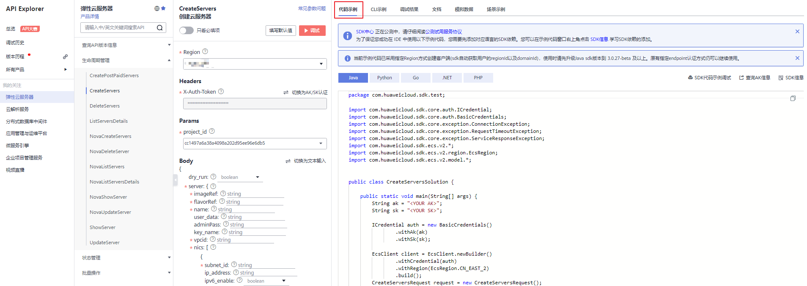

# SDK V3版本简介（新）

本文介绍了各个云服务提供的SDK语言版本，列举了最新版本SDK的获取地址。

## 访问和使用SDK V3版本

登录[SDK中心](https://sdkcenter.developer.huaweicloud.com/)，您可以访问和使用SDK V3版本。

通过SDK中心，您可以选择不同服务、不同语言类型的SDK，包含源码仓库、Nuget仓库以及相关API的入口，如[图1](#fig16212115185)所示。

**图 1**  SDK中心  

## 在线生成SDK代码

[API Explorer](https://apiexplorer.developer.huaweicloud.com/apiexplorer/overview)能根据需要动态生成SDK代码功能，降低您使用SDK的难度，推荐使用。

您可以在[API Explorer](https://apiexplorer.developer.huaweicloud.com/apiexplorer/overview)中具体API页面的“代码示例”页签查看对应编程语言类型的SDK代码，如[图2](#fig142641347183516)所示。

**图 2**  获取SDK代码示例  

## SDK列表

[表1](#table876465371719)提供了各个云服务支持的SDK列表，您可以在GitHub仓库查看SDK更新历史、获取安装包以及查看指导文档。

**表 1**  SDK列表

<table><thead align="left"><tr id="row15765195371712"><th class="cellrowborder" valign="top" width="19.218078192180784%" id="mcps1.2.5.1.1">
编程语言

</th>
<th class="cellrowborder" valign="top" width="32.44675532446755%" id="mcps1.2.5.1.2">
Github地址

</th>
<th class="cellrowborder" valign="top" width="26.277372262773717%" id="mcps1.2.5.1.3">
参考文档

</th>
<th class="cellrowborder" valign="top" width="22.057794220577943%" id="mcps1.2.5.1.4">
视频指导

</th>
</tr>
</thead>
<tbody><tr id="row19765353111710"><td class="cellrowborder" valign="top" width="19.218078192180784%" headers="mcps1.2.5.1.1 ">
Java

</td>
<td class="cellrowborder" valign="top" width="32.44675532446755%" headers="mcps1.2.5.1.2 ">
<a href="https://github.com/huaweicloud/huaweicloud-sdk-java-v3" target="_blank" rel="noopener noreferrer">huaweicloud-sdk-java-v3</a>

</td>
<td class="cellrowborder" valign="top" width="26.277372262773717%" headers="mcps1.2.5.1.3 ">
<a href="https://github.com/huaweicloud/huaweicloud-sdk-java-v3/blob/master/README_CN.md" target="_blank" rel="noopener noreferrer">Java SDK使用指导</a>

</td>
<td class="cellrowborder" valign="top" width="22.057794220577943%" headers="mcps1.2.5.1.4 ">
<a href="https://res-static.hc-cdn.cn/cloudbu-site/china/zh-cn/support/sdk-video/1620783979754083351.mp4" target="_blank" rel="noopener noreferrer">Java SDK视频指导</a>

</td>
</tr>
<tr id="row176525371714"><td class="cellrowborder" valign="top" width="19.218078192180784%" headers="mcps1.2.5.1.1 ">
Python

</td>
<td class="cellrowborder" valign="top" width="32.44675532446755%" headers="mcps1.2.5.1.2 ">
<a href="https://github.com/huaweicloud/huaweicloud-sdk-python-v3" target="_blank" rel="noopener noreferrer">huaweicloud-sdk-python-v3</a>

</td>
<td class="cellrowborder" valign="top" width="26.277372262773717%" headers="mcps1.2.5.1.3 ">
<a href="https://github.com/huaweicloud/huaweicloud-sdk-python-v3/blob/master/README_CN.md" target="_blank" rel="noopener noreferrer">Python SDK使用指导</a>

</td>
<td class="cellrowborder" valign="top" width="22.057794220577943%" headers="mcps1.2.5.1.4 ">
<a href="https://res-static.hc-cdn.cn/cloudbu-site/china/zh-cn/support/sdk-video/1622768970747088213.mp4" target="_blank" rel="noopener noreferrer">Python SDK视频指导</a>

</td>
</tr>
<tr id="row124911696391"><td class="cellrowborder" valign="top" width="19.218078192180784%" headers="mcps1.2.5.1.1 ">
PHP

</td>
<td class="cellrowborder" valign="top" width="32.44675532446755%" headers="mcps1.2.5.1.2 ">
<a href="https://github.com/huaweicloud/huaweicloud-sdk-php-v3" target="_blank" rel="noopener noreferrer">huaweicloud-sdk-php-v3</a>

</td>
<td class="cellrowborder" valign="top" width="26.277372262773717%" headers="mcps1.2.5.1.3 ">
<a href="https://github.com/huaweicloud/huaweicloud-sdk-php-v3/blob/master/README_CN.md" target="_blank" rel="noopener noreferrer">PHP SDK使用指导</a>

</td>
<td class="cellrowborder" valign="top" width="22.057794220577943%" headers="mcps1.2.5.1.4 ">
<a href="https://res-static.hc-cdn.cn/cloudbu-site/china/zh-cn/support/sdk-video/huaweicloud_php_sdk.mp4" target="_blank" rel="noopener noreferrer">PHP SDK视频指导</a>

</td>
</tr>
<tr id="row9765195319171"><td class="cellrowborder" valign="top" width="19.218078192180784%" headers="mcps1.2.5.1.1 ">
Go

</td>
<td class="cellrowborder" valign="top" width="32.44675532446755%" headers="mcps1.2.5.1.2 ">
<a href="https://github.com/huaweicloud/huaweicloud-sdk-go-v3" target="_blank" rel="noopener noreferrer">huaweicloud-sdk-go-v3</a>

</td>
<td class="cellrowborder" valign="top" width="26.277372262773717%" headers="mcps1.2.5.1.3 ">
<a href="https://github.com/huaweicloud/huaweicloud-sdk-go-v3/blob/master/README_CN.md" target="_blank" rel="noopener noreferrer">Go SDK使用指导</a>

</td>
<td class="cellrowborder" valign="top" width="22.057794220577943%" headers="mcps1.2.5.1.4 ">
<a href="https://res-static.hc-cdn.cn/cloudbu-site/china/zh-cn/support/sdk-video/huaweicloud_go_sdk.mp4" target="_blank" rel="noopener noreferrer">Go SDK视频指导</a>

</td>
</tr>
<tr id="row5903131264610"><td class="cellrowborder" valign="top" width="19.218078192180784%" headers="mcps1.2.5.1.1 ">
Node.js

</td>
<td class="cellrowborder" valign="top" width="32.44675532446755%" headers="mcps1.2.5.1.2 ">
<a href="https://github.com/huaweicloud/huaweicloud-sdk-nodejs-v3" target="_blank" rel="noopener noreferrer">huaweicloud-sdk-nodejs-v3</a>

</td>
<td class="cellrowborder" valign="top" width="26.277372262773717%" headers="mcps1.2.5.1.3 ">
<a href="https://github.com/huaweicloud/huaweicloud-sdk-nodejs-v3/blob/master/README_CN.md" target="_blank" rel="noopener noreferrer">Node.js SDK使用指导</a>

</td>
<td class="cellrowborder" valign="top" width="22.057794220577943%" headers="mcps1.2.5.1.4 ">
-

</td>
</tr>
<tr id="row416242415184"><td class="cellrowborder" valign="top" width="19.218078192180784%" headers="mcps1.2.5.1.1 ">
.NET

</td>
<td class="cellrowborder" valign="top" width="32.44675532446755%" headers="mcps1.2.5.1.2 ">
<a href="https://github.com/huaweicloud/huaweicloud-sdk-net-v3" target="_blank" rel="noopener noreferrer">huaweicloud-sdk-net-v3</a>

</td>
<td class="cellrowborder" valign="top" width="26.277372262773717%" headers="mcps1.2.5.1.3 ">
<a href="https://github.com/huaweicloud/huaweicloud-sdk-net-v3/blob/master/README_CN.md" target="_blank" rel="noopener noreferrer">.Net SDK使用指导</a>

</td>
<td class="cellrowborder" valign="top" width="22.057794220577943%" headers="mcps1.2.5.1.4 ">
-

</td>
</tr>
</tbody>
</table>

