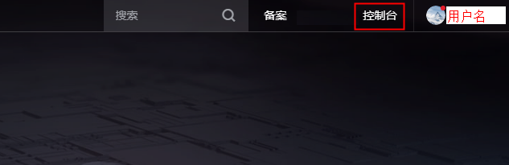
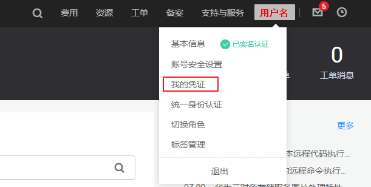
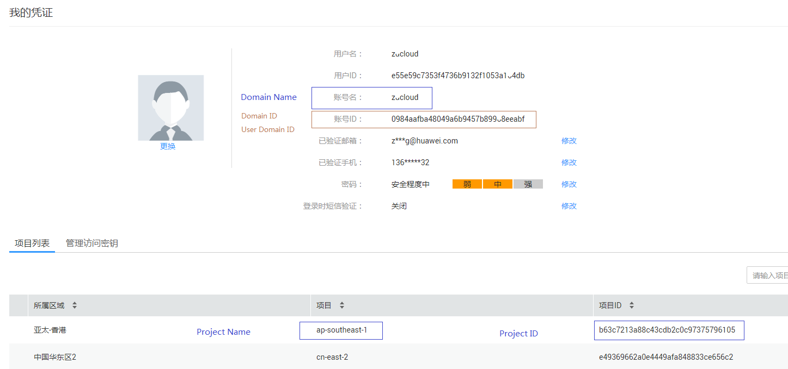

# 如何获取domain\_name、project\_name和project\_id ?

## 前提条件

已经登录控制台。

## 步骤

1.  在华为云首页右上角，点击“控制台”。

    **图 1**  控制台  
    

2.  在右上角的用户名中选择“我的凭证“。

    **图 2**  我的凭证  
    

3.  在“我的凭证”界面，API凭证页签中，查看并记录用户名、用户ID、账号名、账号ID、项目名称、项目ID。

    **图 3**  我的凭证详情  
    

